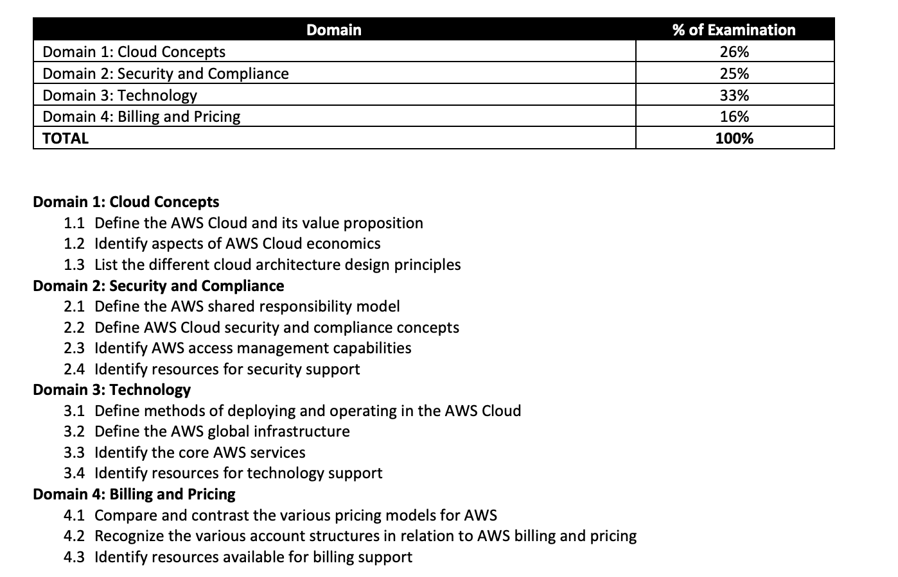
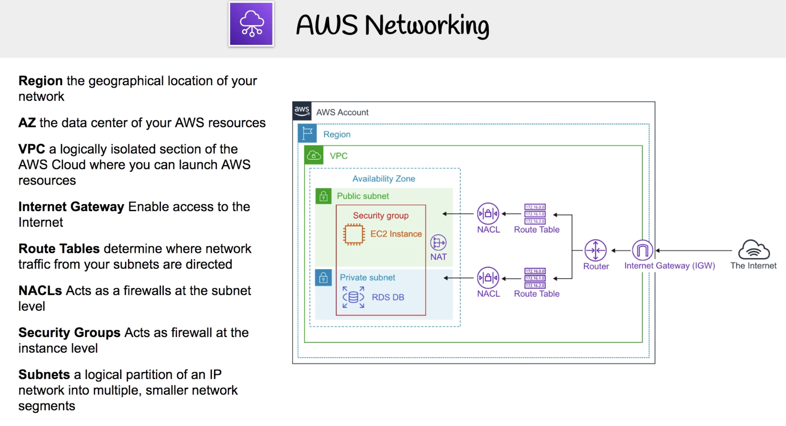
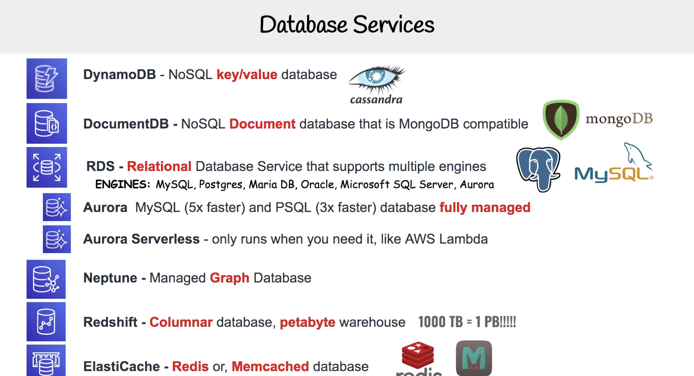
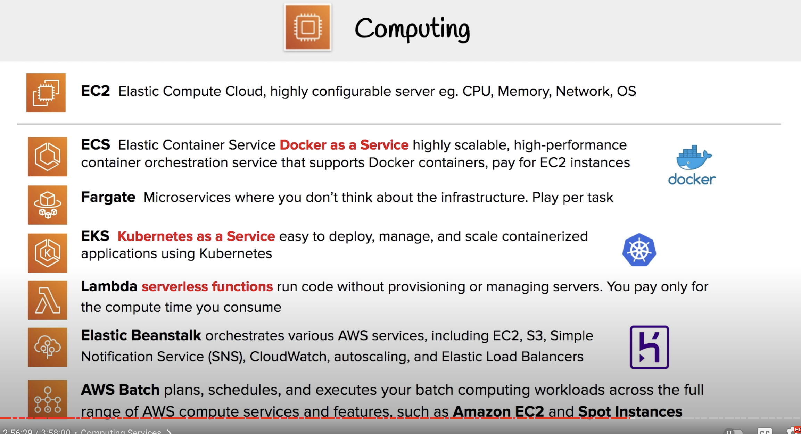
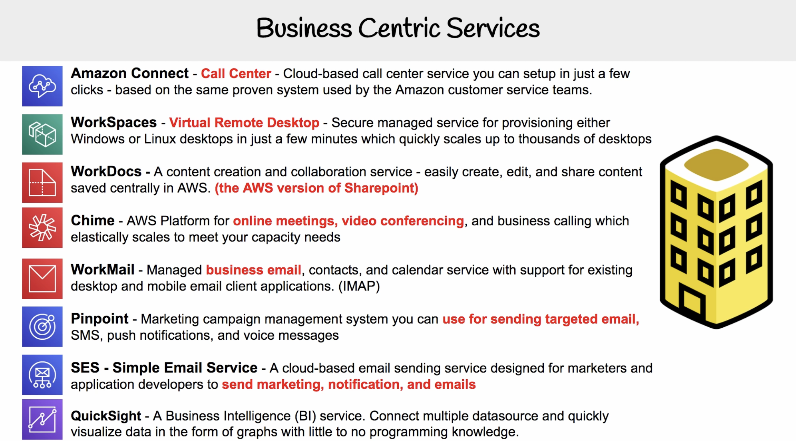
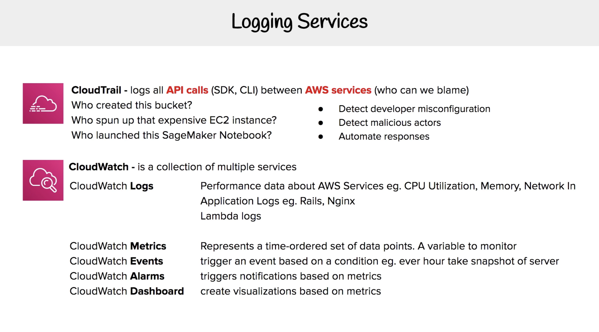
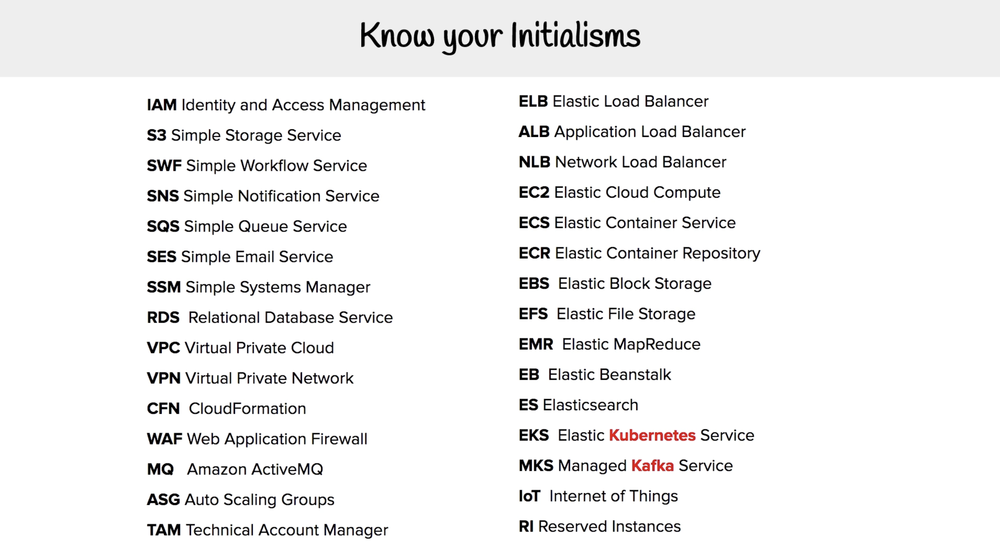
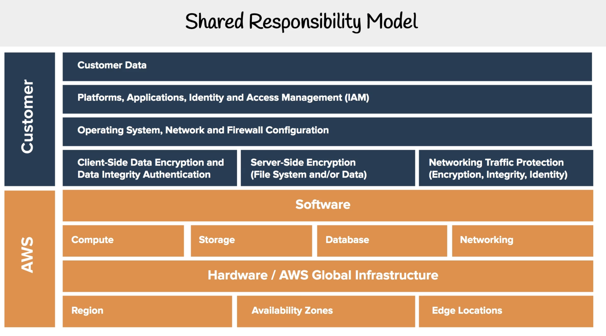
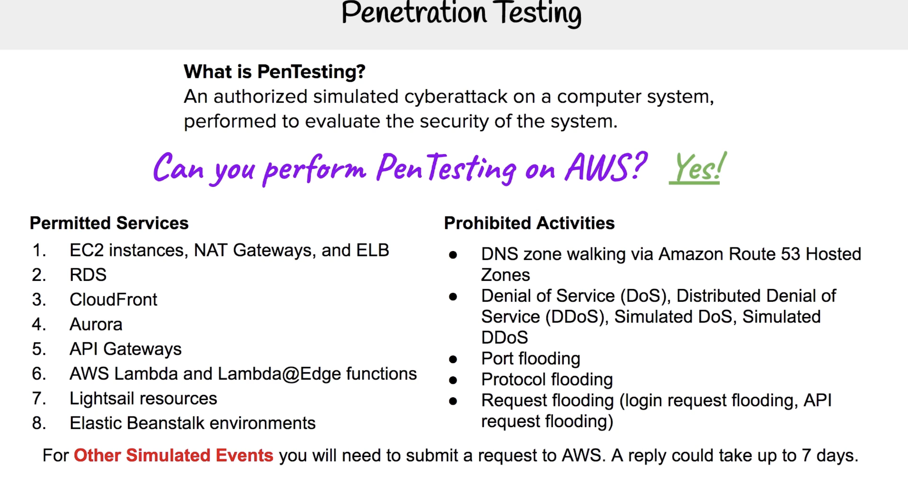
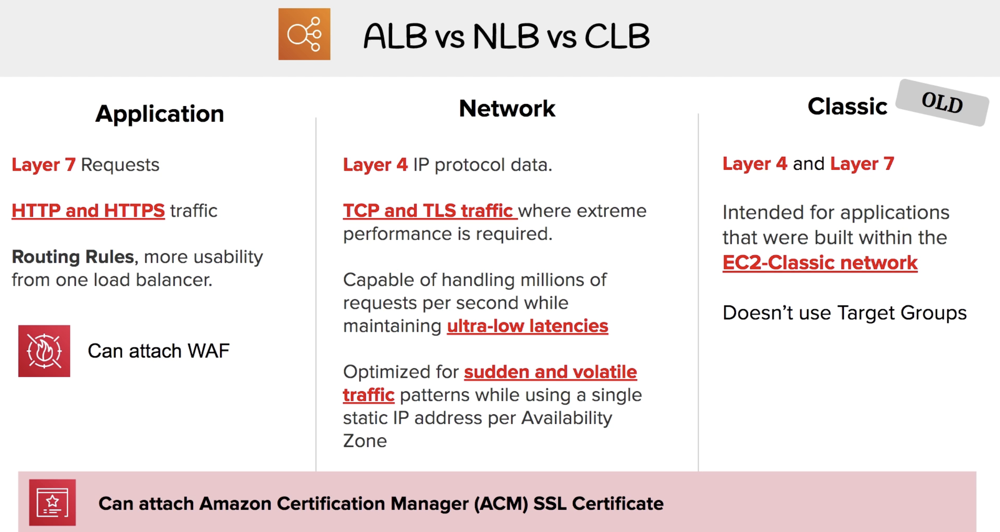

<h2>Cloud Concepts</h2>

**AWS Cloud Value Framework**
a. Cost Savings - Total Cost of Ownership (TCO) reduction
b. Staff Productivity
c. Operational Resilience d. Business Agility

Six Advantages and Benefits of Cloud Computing

Types of Cloud Computing - SaaS , PaaS and IaaS

Cloud Computing Deployment Models - Cloud, Hybrid, On-Premise

---------------

<h2>AWS Global Infrastructure - (Technology) </h2>

Map Overview

Regions - A separate geographical location with multiple locations that are isolated from each other

Availability Zones - 25 Launched Regions (geographically distinct), 80 Availability Zones , 218+ Edge Locations.

AZs are physically separated by a meaningful distance, many kilometers, from any other AZ, although all are within 100 km (60 miles) of each other. A fully isolated portion of the AWS global infrastructure. and **<10ms latency between AZs**  

Edge Locations - Owned by Trusted partner/serve requests for Cloudfront and Route 53. Sometimes also used by S3 Transfer Acceleration and API Gateway. 
Reliable, **low latency** and high throughput network connectivity

GovCloud Regions - host sensitive Controlled Unclassified Information

---------------

Creating an AWS Account

Billing Preferences, Budgets and Alarms

Change IAM Users

Sign-in Link

Activate MFA on Root Account

Create individual IAM user

Set a password policy

---------------
Hands On

Regions

**EC2(Elastic Compute Cloud) - Virtual servers in the cloud** : 
Amazon Machine Image (AMI) / IAM roles /storage - Free tier eligible customers can get up to 30 GB of EBS General Purpose (SSD) or Magnetic storage.

Sessions Manager

AMI

Auto Scaling GroupsAmazon:  EC2 Auto Scaling
helps maintain the availability of your applications
Auto Scaling groups are collections of Amazon EC2 instances that enable automatic scaling and fleet management features. These features help you maintain the health and availability of your applications.

Elastic Load Balancer:
3 types - Application, Network, Gateway load and Classic 

S3: Simple Storage Service - Scalable storage in the cloud

CloudFront - Global CDN(Content Distibution Network)

RDS - Relational Database Service

Lambda - Run serverless functions (code) without thinking about provisioning or managing servers or clusters / runtime limit - 15 minutes

---------------

<h2>EC2 Pricing Models</h2>

<u>On-Demand(default)</u>: **no long term commitment / no upfront payment**

**for short-term,spikey or unpredictable workloads**

pay per hour or minute/
low-cost& flexible/
suitable for first time apps

<u>Reserved</u> :(reserved instances) for stable apps with predictable usage. Reduced Pricimg = Term x Class Offering x Payment Option

**commitment to 1 or 3 Year contract** &
payment options are **Upfront/Partial-upfront or no upfront**

**best option for longterm**

<u>Spot instances</u>: Biggest savings(90%)
Suitable for flexible apps with flexible start and end who use idle AWs servers given out on the spot.

**Instances can be cancelled at anytime by AWS and you don't get charged by them for a partial hour usage. You however get charged for an hour if you cancel a partial hour usage yourself**

<u>Dedicated Host Instances</u>: (Most expensive)
for users with strict licensing (e.g regulatory) option which comes in On-Demand or Reserved flavours.

Amazon EC2 Savings Plans enable you to reduce your compute costs by committing to a consistent amount of compute usage for a 1-year or 3-year term. This results in savings of up to 72% over On-Demand Instance costs.

**Multi-tenant(virtual isolation) vs Single tenant (physical isolation)**

---------------

<h2>Billing and Pricing</h2>

Free Services - N.B some of these free services are free but they can setup services that are paid e.g **CloudFormation**, Amplify. Beanstalk 

AWS Support Plans: **Four -Basic, Developer, Business and Enterprise**

Basic - email support only for billing and account at $0 per month

Developer - within 24 hr response email support with no third party support at $20/month

Business - within 24hr response email support with chat or phone third party support at $100/month

Enterprise - within 24hr response email support with chat or phone third party support and a personal conceirge and TAM  at $15000/month.

*Key response times*:
**System Impaired < 12hr / Production system impaired < 4hr / Production system down < 1hr / Enterprise critical system down response time of <15m.

AWS Marketplace

<u>AWS Trusted Advisor </u> - (advice on **saving money**, performance, fault tolerance). 7 for Free & developer , All for Business and Enterprise  
Cost Optimization - e.g  idle Load Balancers & Unassociated Elastic IP addresses  
Performance - High Utilization Amazon EC2 Instances

Security - MFA on Root Account, IAM Access Key rotations 

Fault Tolerance - Amazon RDS Backups

Service Limits - VPC 

**CPSFS*

Consolidated Billing - all charges consolidated into **one bill**
The **master account** can pay the expenses of member account and you can use the cost explorer to visualize the costs.

Consolidated Billing Volume Discounts

AWS Cost Explorer

AWS Budgets: first 2 budgets are free. subsequent are $0.02 per day / 20,000 budgets limit

Cost, usage and reservation budgets. Alerts support EC2, RDS, Redshift, ElasticCache etc. 

TCO(Total Cost of Ownership) Calculator

AWS Landing Zone - helps **Enterprises** quickly set up AWS multi-account architecture via *AWS AVM(Account Vending Machine)

Resource Groups and Tagging
 - *Tags* are words/phrases that act as metadata for organizing AWS *resources* while *Resource groups* are a collection of resources that share one or more tags. RG show details about metrics, alarms and Config settings.

AWS QuickStart: 3 parts
 1. reference achictecture 2. CloudFormation Templates 3. Deployment guide

AWS Cost and Usage Report
- generate detailed spreadsheet that are placed in **S3** & can be queried as a database using **Athena** and/or visualized as graphs using **Quicksight** 

---------------
---------------

<h2>Technology Overview</h2>
AWS Organizations and Accounts: Service control policies gives you control permissions over all accounts in the organization.

AWS Networking

Database Services

N.B Amazon Aurora: A *fully-managed enterprise-class* relational database

Provisioning Services:

AWS Elastic Beanstalk is an easy-to-use service for deploying and scaling web applications and services developed with Java, .NET, PHP, Node.js, Python

Computing Services

Storage Services

- S3: object storage / S3 Glacier: low cost long-term archive and backup / Storage Gateway: Hybrid cloud storage with local caching / Snowcone (8TB)/ Snowballs Edge (50TB(compute-optimized) and 80TB(storage optimized) versions) / ~~Snowball Edge (100TB)~~, Snowmobile (100PB)

S3 Intelligent-Tiering monitors access patterns of objects and automatically moves them between the S3 Standard and S3 Standard-IA storage classes. It is not designed for archival data.
S3 Standard-IA is ideal for data that is infrequently accessed but requires high availability when needed.

Business Centric Services

Enterprise Integration

Logging Services

Know your Initialisms

---------------
---------------

<h2>AWS Security</h2>
Shared Responsibility Model: Customers are responsible for security *in* the cloud (by setting app data config) and Amazon is responsible for security *of* the cloud(taking care of software, managed services & global infastructure hardware)

AWS Compliance programs e.g Cloud Act 2018, HIPAA 1996 & PCI DSS

AWS Artifact - no cost AWS Compliance and security reports and agreements service - global compliance framworks 

Amazon Inspector e.g Analyze application security. e.g you can use a framework like CIS - 699 checks

AWS WAF (Web Application Firewall) - helps protect web application from common attacks like OWASP Top 10 either through **writing your own rules** or getting a **ruleset from WAF markeplace** and then attaching it to your load balancer or Cloudfront (CDN)

AWS Shield - **managed** DDOS service . Shield Standard (Free and automatically turned on all AWS services for common attacks ) / Shield Advanced *$3000* (larger and sophisticated attacks and turned on AWS route54, Cloudfront, LB, Elastic IP &Global Accelerator plus visibility dashboard and DDOS expoerts ) 

Penetration Testing

GuardDuty - A service that provides intelligent threat detection for your AWS infrastructure and resources. e.g. Intelligent Intrusion Detection System(IDS)/Intrusion Protection System(IPS)

Key Management Service (KMS) - encryption keys (KMS uses Envelope Encryption and is a multi-tenant HSM(Hardware security module))

Amazon Macie - data security and data privacy service for S3 using ML

Security Groups(firewall at the **instance level** where you create *Allow* rules cos they implicitly deny all traffic) vs NACLs(firewall at the **subnet level** where you create *Allow&Deny* rules e.g Block a specific malicious IP)

N.B Security groups are stateful. This means that they use previous traffic patterns and flows when evaluating new requests for an instance.

AWS VPN - *private tunnel*

---------------
---------------

<h2>Variation Study</h2>

Cloud* Service

*Connect Service

Elastic Transcoder(old) vs Media Convert (new) : Both transcode videos to streaming formats with Media convert getting new additional features 

Simple Notifications Service (for Pub/Sub) vs Simple Queue Service: Both SNS & SQS *connect apps via messages* with SNS usually triggered by other AWS services e.g billing alarms to send *plain text emails* or text. These notifications can be retry/resent in case of an HTTP error. SQS queue messages with AWS SDK whilst promising guaranted delivery and can also retaining messages for 14 days. 

Inspector vs Trusted Advisor : Both are security tools with Inspector fixating on only a *single EC2 instance* whilst TA gives holistic view but *doesnt generate PDFs* like Inspector

ALB vs NLB vs CLB

There's also the Gateway load which is for private virtual network using GENEVE

SNS vs SES
Simple Notification Service (for *plain text emails for *subscribers of topics*) whilst Simple Email Service (cloud based email service that can send html emails which SNS cant do and also has its own email templates and can monitor and get inbound emails  )

Artifact(global compliance checks) vs Inspector(application security): Both generate PDFs though

**More terms**
- The AWS Command Line Interface (AWS CLI) is used to automate actions for AWS services and applications through scripts.

- Software development kits (SDKs) enable you to develop AWS applications in supported programming languages.

- AWS Outposts is a service that enables you to run infrastructure in a hybrid cloud approach.

- **EBS volumes store data within a single Availability Zone. Amazon EFS file systems store data across multiple Availability Zones.** because an EBS(Elastic block store) volume must be located in the same Availability Zone as the Amazon EC2 instance to which it is attached.
Data in an Amazon EFS file system can be accessed concurrently from all the Availability Zones in the Region where the file system is located.
Amazon Elastic Block Store (Amazon EBS) is a service that provides block-level storage volumes that you can use with Amazon EC2 instances.

- Amazon Quantum Ledger Database (Amazon QLDB) is a ledger database service. You can use Amazon QLDB to review a complete history of all the changes that have been made to your application data.

- Amazon DynamoDB Accelerator (DAX) is an in-memory cache for DynamoDB

The **AWS Cloud Adoption Framework (AWS CAF)** organizes guidance into six areas of focus, **called Perspectives**
- the Business, People, and Governance Perspectives focus on *business capabilities* 
- Platform, Security, and Operations Perspectives focus on *technical capabilities.*

6 strategies for migration
- Rehosting / Replatforming / Refactoring or re-architecting / Repurchasing / Retaining / Retiring

Amazon SageMaker to remove the difficult work from the process and empower you to build, train, and deploy ML models quickly

AWS DeepRacer is an autonomous 1/18 scale race car that you can use to test reinforcement learning models.

### The Well-Architected Framework is based on five pillars: 
The AWS Well-Architected Framework helps you understand how to design and operate reliable, secure, efficient, and cost-effective systems in the AWS Cloud
- Operational excellence
- Security
- Reliability
- Performance efficiency
- Cost optimization

Amazon Augmented AI (Amazon A2I) provides built-in human review workflows for common machine learning use cases, such as content moderation and text extraction from documents.

Amazon Kendra: Highly accurate enterprise search service powered by machine learning

Kinesis : Work with Real-Time Streaming Data

Athena:  Query Data in S3 using SQL

Amazon Sumerian:  Build VR, AR, and 3D applications

AWS Fargate is a serverless compute engine for containers.

Cognito: AWS Credentials for Federated Identities

Systems Manager: AWS Systems Manager is a Central Place to View and Manage AWS Resources

Amazon Rekognition: Search and Analyze Images

AMIs come in three main categories:
Community AMIs– free to use, generally you just select the operating system you want
AWS Marketplace AMIs– pay to use, generally come packaged with additional, licensed software
My AMIs– AMIs that you create yourself

Amazon Comprehend is a natural language processing (NLP) service that uses machine learning to find insights and relationships in text.

DynamoDB is fully managed and can be scaled without incurring downtime
Both RDS and ElastiCache use EC2 instances and therefore scaling (vertically) requires downtime

Both Amazon EC2 and Amazon S3 are managed at a regional level. Note: Amazon S3 is a global namespace but you still create your buckets within a region
CloudFront, Route 52 and IAM and managed at a global level

