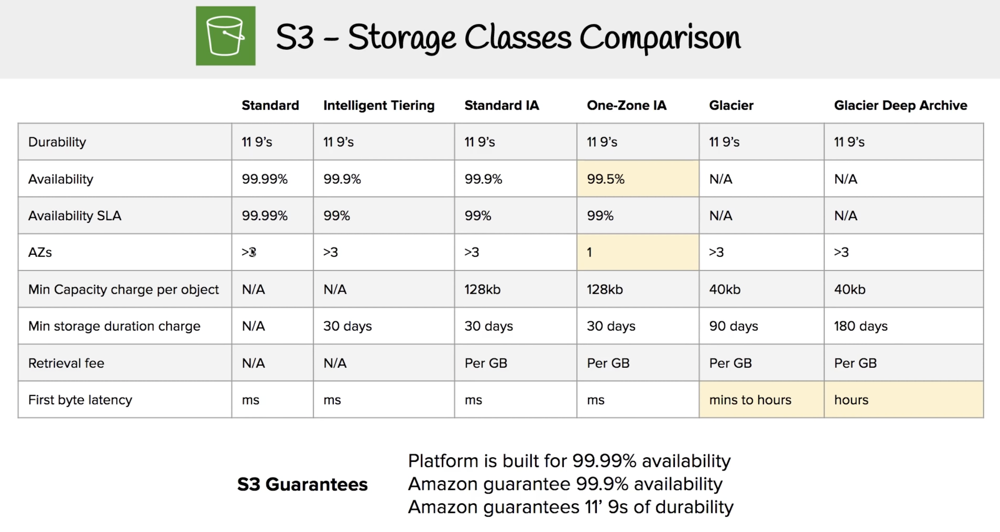

## AWS Certified Solutions Architect – Associate
(SAA-C02) 

720/1000 - 65 Questions

-  Define a solution using architectural design principles based on customer requirements.
-  Provide implementation guidance based on best practices to an organization throughout the lifecycle of a
project

**Whitepapers**

Study tip: Focus on the following whitepapers

AWS Well-Architected webpage : https://aws.amazon.com/architecture/well-architected/

Study tip: Focus on the following FAQs

Amazon EC2(https://aws.amazon.com/ec2/faqs/) || Amazon S3(https://aws.amazon.com/s3/faqs/) || Amazon VPC(https://aws.amazon.com/vpc/faqs/) || Amazon Route 53(https://aws.amazon.com/route53/faqs/) || Amazon RDS(https://aws.amazon.com/rds/faqs/) || Amazon SQS(https://aws.amazon.com/sqs/faqs/)

Readinesss: https://www.aws.training/Details/Curriculum?id=20685

---

<h2>S3</h2>
You can store 0 - 5 terabytes. Amazon S3 are managed at a regional level. Note: Amazon S3 is a global namespace but you still create your buckets within a region

- S3: object storage / S3 Glacier: low cost long-term archive and backup / Storage Gateway: Hybrid cloud storage with local caching / Snowcone (8TB)/ Snowballs Edge (50TB(compute-optimized) and 80TB(storage optimized) versions) / ~~Snowball Edge (100TB)~~, Snowmobile (100PB)

- S3 Intelligent-Tiering monitors access patterns of objects and automatically moves them between the S3 Standard and S3 Standard-IA storage classes. It is not designed for archival data.
- S3 Standard-IA is ideal for data that is infrequently accessed but requires high availability when needed.

