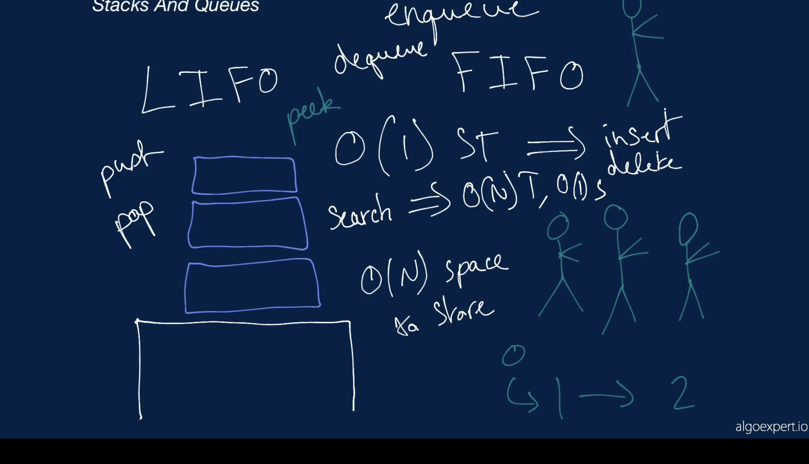
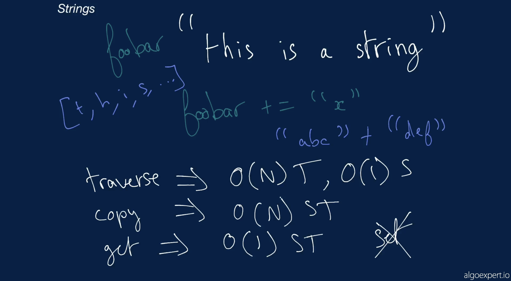
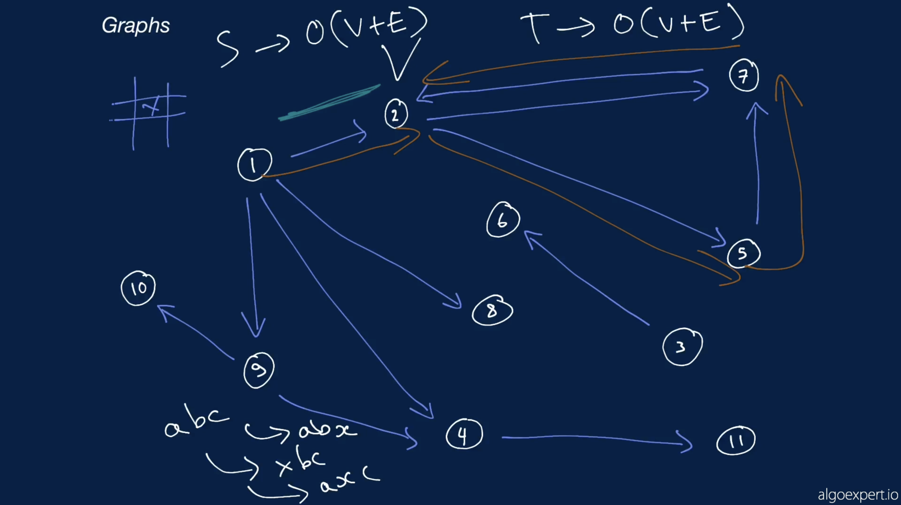

## Coding Interview Questions

## Arrays

Two Number Sum

<pre>function twoNumberSum(array, targetSum) {
   const nums = {};
   for (const num of array){
   const y = targetSum - num
   //array.includes(y)
   if ( y in nums ) {
   return [y, num]
   } else {
   nums[num] = true;
   }
   }
   return [];
   }
</pre>

o(n) T & o(n) S

function twoNumberSum(array, targetSum) {
// Write your code here.
for (let i = 0; i < array.length - 1; i++) {
let firstNum = array[i]
for (let j = i + 1; j < array.length; j ++){
let secondNum = array[j];
if (firstNum + secondNum === targetSum ){
return [firstNum, secondNum]
}
}
}
return []
}

## Data Structures Crash Course (Algoexpert)

Complexity Analysis: 
The process of determining how efficient an algorithm is. Complexity analysis usually involves finding both the
<b>time complexity</b> and the <b>space complexity</b> of an algorithm.

---

<h2>Big O notation 
</h2> - a powerful tool that allows us to generalize the space-time complexity of an algorithm as a function of its input size.

  The notation used to describe the <b>time complexity</b> and
  <b>space complexity</b> of algorithms.

  Variables used in Big O notation denote the sizes of inputs to algorithms. For
  example, <b>O(n)</b> might be the time complexity of an algorithm that
  traverses through an array of length <b>n</b>; similarly,
  <b>O(n + m)</b> might be the time complexity of an algorithm that traverses
  through an array of length <b>n</b> and through a string of length <b>m</b>.

  The following are examples of common complexities and their Big O notations,
  ordered from fastest to slowest:

<ul>
  <li><b>Constant</b>: O(1)</li>
  <li><b>Logarithmic</b>: O(log(n))</li>
  <li><b>Linear</b>: O(n)</li>
  <li><b>Log-linear</b>: O(nlog(n))</li>
  <li><b>Quadratic</b>: O(n2)</li>
  <li><b>Cubic</b>: O(n3)</li>
  <li><b>Exponential</b>: O(2n)</li>
  <li><b>Factorial</b>: O(n!)</li>
</ul>

  Note that in the context of coding interviews, Big O notation is usually
  understood to describe the
  <b>worst-case</b> complexity of an algorithm, even though the worst-case
  complexity might differ from the <b>average-case</b> complexity.

  For example, some sorting algorithms have different time complexities
  depending on the layout of elements in their input array. In rare cases, their
  time complexity will be much worse than in more common cases. Similarly, an
  algorithm that takes in a string and performs special operations on uppercase
  characters might have a different time complexity when run on an input string
  of only uppercase characters vs. on an input string with just a few uppercase
  characters.

  Thus, when describing the time complexity of an algorithm, it can sometimes be
  helpful to specify whether the time complexity refers to the average case or
  to the worst case (e.g., "this algorithm runs in O(nlog(n)) time on average
  and in O(n2) time in the worse case").

Brief overwiew: https://www.youtube.com/watch?v=__vX2sjlpXU

---

<h2>Logarithm</h2>

<b>logb(x) = y</b> if and only if <b>by = x</b>

Thus => 
<b>log(n) = y</b> if and only if <b>2y = n</b>

Key point:

<u>To find the (binary) logarithm of base of a number We have to say <b>2</b> to the **power** of **?** is that number. </u> if we solve that, **?** is the **log of N**

Thus, To double **N**, we only need to increase **y** by 1. E.g: 22 = 4; 22+1 = 23 which **6**

If n doubles, log(n) only increases by 1

In plain English, if an algorithm has a logarithmic time complexity (<b>O(log(n))</b>, where n is the size of the input), then whenever the algorithm's input doubles in size (i.e., whenever <b>n</b> doubles), the number of
operations needed to
complete the algorithm only increases by one unit. Conversely, an algorithm with a linear time complexity would
see its number of operations double if its input size doubled.

---

<h2>Arrays</h2>

2 types of Array:
Static & Dynamic

Static array operations and respective time and space complexities:

<h4>Array</h4>

  A linear collection of data values that are accessible at numbered indices,
  starting at index 0.

  The following are an array's standard operations and their corresponding time
  complexities:

<ul>
  <li><b>Accessing a value at a given index</b>: O(1)</li>
  <li><b>Updating a value at a given index</b>: O(1)</li>
  <li><b>Inserting a value at the beginning</b>: O(n)</li>
  <li><b>Inserting a value in the middle</b>: O(n)</li>
  <li>
    <b>Inserting a value at the end</b>:
    <ul>
      <li>amortized O(1) when dealing with a <b>dynamic array</b></li>
      <li>O(n) when dealing with a <b>static array</b></li>
    </ul>
  </li>
  <li><b>Removing a value at the beginning</b>: O(n)</li>
  <li><b>Removing a value in the middle</b>: O(n)</li>
  <li><b>Removing a value at the end</b>: O(1)</li>
  <li><b>Copying the array</b>: O(n)</li>
</ul>

  A static array is an implementation of an array that allocates a fixed amount
  of memory to be used for storing the array's values. Appending values to the
  array therefore involves copying the entire array and allocating new memory
  for it, accounting for the extra space needed for the newly appended value.
  This is a linear-time operation.

  A dynamic array is an implementation of an array that preemptively allocates
  double the amount of memory needed to store the array's values. Appending
  values to the array is a constant-time operation until the allocated memory is
  filled up, at which point the array is copied and double the memory is once
  again allocated for it. This implementation leads to an amortized
  constant-time insertion-at-end operation.

  A lot of popular programming languages like JavaScript and Python implement
  arrays as dynamic arrays.

---

<h2>Linked Lists</h2> 
A big difference between Linked Lists and arrays is that while arrays need back to back spaces in the memory to create an array. Linked Lists use any spaces available in the memory and then connect to one another (i.e other nodes) using pointers.

[Single Linked List](https://www.theavocoder.com/data-structures/2018/12/23/singly-linked-list)

Each node needs 2 back to back memory slots. one showing the value and the other showing the pointer. That's for the singly linked list

The double linkedlist has got two pointers. one pointing to the next node and the other pointing to the previous(prev) node.

[Doubly linked list](https://www.theavocoder.com/data-structures/2018/12/23/doubly-linked-list)

<li><h4 >Singly Linked List</h4>

  A data structure that consists of nodes, each with some value and a pointer to
  the next node in the linked list. A linked list node's value and next node are
  typically stored in value
  and
  next properties, respectively.

  The first node in a linked list is referred to as the <b>head</b> of the
  linked list, while the last node in a linked list, whose
  next property points to the null value, is known as
  the <b>tail</b> of the linked list.

  Below is a visual representation of a singly linked list whose nodes hold
  integer values:

<pre>0 -&gt; 1 -&gt; 2 -&gt; 3 -&gt; 4 -&gt; 5 -&gt; null
</pre>

  A singly linked list typically exposes its head to its user for easy access.
  While finding a node in a singly linked list involves traversing through all
  of the nodes leading up to the node in question (as opposed to instant access
  with an array), adding or removing nodes simply involves overwriting
  next pointers (assuming that you have access to the node right
  before the node that you're adding or removing).

  The following are a singly linked list's standard operations and their
  corresponding time complexities:

<ul>
  <li><b>Accessing the head</b>: O(1)</li>
  <li><b>Accessing the tail</b>: O(n)</li>
  <li><b>Accessing a middle node</b>: O(n)</li>
  <li><b>Inserting / Removing the head</b>: O(1)</li>
  <li><b>Inserting / Removing the tail</b>: O(n) to access + O(1)</li>
  <li><b>Inserting / Removing a middle node</b>: O(n) to access + O(1)</li>
  <li><b>Searching for a value</b>: O(n)</li>
</ul>
</li><li><h4>Doubly Linked List</h4>

  Similar to a <b>singly linked list</b>, except that each node in a doubly
  linked list also has a pointer to the previous node in the linked list. The
  previous node is typically stored in a prev property.

  Just as the next property of a doubly linked list's
  <b>tail</b> points to the null value, so too does the
  prev property of a doubly linked list's <b>head</b>.

  Below is a visual representation of a doubly linked list whose nodes hold
  integer values:

<pre>null &lt;- 0 &lt;-&gt; 1 &lt;-&gt; 2 &lt;-&gt; 3 &lt;-&gt; 4 &lt;-&gt; 5 -&gt; null
</pre>

  While a doubly linked list typically exposes both its head and tail to its
  user, as opposed to just its head in the case of a singly linked list, it
  otherwise behaves very similarly to a singly linked list.

  The following are a doubly linked list's standard operations and their
  corresponding time complexities:

<ul>
  <li><b>Accessing the head</b>: O(1)</li>
  <li><b>Accessing the tail</b>: O(1)</li>
  <li><b>Accessing a middle node</b>: O(n)</li>
  <li><b>Inserting / Removing the head</b>: O(1)</li>
  <li><b>Inserting / Removing the tail</b>: O(1)</li>
  <li><b>Inserting / Removing a middle node</b>: O(n) to access + O(1)</li>
  <li><b>Searching for a value</b>: O(n)</li>
</ul>
</li><li><h4 >Circular Linked List</h4>

  A linked list that has no clear <b>head</b> or <b>tail</b>, because its "tail"
  points to its "head," effectively forming a closed circle.

  A circular linked list can be either a <b>singly circular linked list</b> or a
  <b>doubly circular linked list</b>.

</li>

---

<h2>Hash Tables</h2>

key:value data structure. The fact that they have these pairs makes <u>insertion, delete and search</u> all have **time complexities of constant time operations - O(i)**

Unlike arrays where the identifiers are indices and are not strings. In hash tables, the keys can be strings. Thus, one needs a hash function to convert them to integers as indices.

[Hash tables](https://www.theavocoder.com/data-structures/2018/12/23/hash-table)

---

<h2>Stacks and Queues</h2>

[Stacks](https://www.theavocoder.com/data-structures/2018/12/22/stacks) LIFO

[Queues](https://www.theavocoder.com/data-structures/2018/12/23/asoosfdsvt187fj6tri2t88dn01aab) FIFO. They're most treated as Linked List

<ul ><li><h4 >Stack</h4>

  An array-like data structure whose elements follow the <b>LIFO</b> rule: <b>L</b>ast <b>I</b>n, <b>F</b>irst
  <b>O</b>ut.

  A stack is often compared to a stack of books on a table: the last book that's placed on the stack of books is the
  first one that's taken off the stack.

  The following are a stack's standard operations and their
  corresponding time complexities:

<ul>
  <li><b>Pushing an element onto the stack</b>: O(1)</li>
  <li><b>Popping an element off the stack</b>: O(1)</li>
  <li><b>Peeking at the element on the top of the stack</b>: O(1)</li>
  <li><b>Searching for an element in the stack</b>: O(n)</li>
</ul>

  A stack is typically implemented with a <b>dynamic array</b> or with a <b>singly linked list</b>.

</li><li><h4>Queue</h4>

  An array-like data structure whose elements follow the <b>FIFO</b> rule: <b>F</b>irst <b>I</b>n, <b>F</b>irst
  <b>O</b>ut.

  A queue is often compared to a group of people standing in line to purchase items at a store: the first person to get
  in line is the
  first one to purchase items and to get out of the queue.

  The following are a queue's standard operations and their
  corresponding time complexities:

<ul>
  <li><b>Enqueuing an element into the queue</b>: O(1)</li>
  <li><b>Dequeuing an element out of the queue</b>: O(1)</li>
  <li><b>Peeking at the element at the front of the queue</b>: O(1)</li>
  <li><b>Searching for an element in the queue</b>: O(n)</li>
</ul>

  A queue is typically implemented with a <b>doubly linked list</b>.

</li></ul>

---

<h2>Strings</h2>

<ul class="_11yBtxJAfoXvpm8jCVEmEs"><li><h4 class="GyBtJFVn5Wz_IeSLo-24A">String</h4>

  One of the fundamental data types in Computer Science, strings are stored in
  <b>memory</b> as <b>arrays</b> of integers, where each character in a given
  string is mapped to an integer via some character-encoding standard like
  <b>ASCII</b>.

  Strings behave much like normal arrays, with the main distinction being that,
  in most programming languages (C++ is a notable exception), strings are
  <b>immutable</b>, meaning that they can't be edited after creation. This also
  means that simple operations like appending a character to a string are more
  expensive than they might appear.

  The canonical example of an operation that's deceptively expensive due to
  string immutability is the following:

<pre>string = "this is a string"
newString = ""

for character in string:
newString += character

</pre>

  The operation above has a time complexity of <b>O(n2)</b> where n
  is the length of string, because each addition of a character to
  newString creates an entirely new string and is itself an
  <b>O(n)</b> operation. Therefore, n O(n) operations are performed, leading to
  an O(n2) time-complexity operation overall.

</li></ul>

---

<h2>Graphs</h2>

N.B

a. When you're dealing with cyclic graphs in a coding interview, you would want to make sure that you don't <u>end up with infinite loops</u>

b. Connectivity, direction and cycles are 3 important concepts to pay attention

In graph, you can search, remove and add nodes, as well as search, remove, and add nodes and edges. One way to represent a graph is by using an adjacency list.

[Graphs](https://www.theavocoder.com/data-structures/2018/12/24/graphs)

c. Traversal: DFS (Depth-First Search) & BFS(Breadth-First Search)

---

<h2>Trees</h2>

N.B
a. A tree is acyclic - not a cycle where a child node would have a direction back to the root/parent node

b. a tree can't be disconnected

<ul class="_11yBtxJAfoXvpm8jCVEmEs"><li><h4 class="GyBtJFVn5Wz_IeSLo-24A">Tree</h4>

  A data structure that consists of nodes, each with some value and pointers to
  child-nodes, which recursively form <b>subtrees</b> in the tree.

  The first node in a tree is referred to as the <b>root</b> of the tree, while
  the nodes at the bottom of a tree (the nodes with no child-nodes) are referred
  to as <b>leaf nodes</b> or simply <b>leaves</b>. The paths between the root of
  a tree and its leaves are called <b>branches</b>, and the <b>height</b> of a
  tree is the length of its longest branch. The <b>depth</b> of a tree node is
  its distance from its tree's root; this is also known as the node's
  <b>level</b> in the tree.

  A tree is effectively a <b>graph</b> that's <b>connected</b>, <b>directed</b>,
  and <b>acyclic</b>, that has an explicit root node, and whose nodes all have a
  single <b>parent</b> (except for the root node, which effectively has no
  parent). Note that in most implementations of trees, tree nodes don't have a
  pointer to their parent, but they can if desired.

  There are many types of trees and tree-like structures, including
  <b>binary trees</b>, <b>heaps</b>, and <b>tries</b>.

</li><li><h4 class="GyBtJFVn5Wz_IeSLo-24A">Binary Tree</h4>

A <b>tree</b> whose nodes have up to <b>two</b> child-nodes.

  The structure of a binary tree is such that many of its operations have a
  logarithmic time complexity, making the binary tree an incredibly attractive
  and commonly used data structure.

</li><li><h4 class="GyBtJFVn5Wz_IeSLo-24A">K-ary Tree</h4>

  A <b>tree</b> whose nodes have up to <b>k</b> child-nodes. A
  <b>binary tree</b> is a k-ary tree where <b>k == 2</b>.

</li><li><h4 class="GyBtJFVn5Wz_IeSLo-24A">Perfect Binary Tree</h4>

  A <b>binary tree</b> whose interior nodes all have two child-nodes and whose
  <b>leaf nodes</b> all have the same <b>depth</b>. Example:

<pre>           1
      /         \
     2           3
   /   \       /   \
  4     5     6     7
 / \   / \   / \   / \
8   9 10 11 12 13 14 15
</pre>
</li><li><h4 class="GyBtJFVn5Wz_IeSLo-24A">Complete Binary Tree</h4>

  A <b>binary tree</b> that's <i>almost</i> <b>perfect</b>; its interior nodes
  all have two child-nodes, but its <b>leaf nodes</b> don't necessarily all have
  the same <b>depth</b>. Furthermore, the nodes in the last <b>level</b> of a
  complete binary tree are as far left as possible. Example:

<pre>          1
       /     \
      2       3
    /   \   /   \
   4     5 6     7
 /   \
8     9
</pre>

  Conversely, the following binary tree <i>isn't</i> complete, because the nodes
  in its last level aren't as far left as possible:

<pre>          1
       /     \
      2       3
    /   \   /   \
   4     5 6     7
         /   \
        8     9
</pre>
</li><li><h4 class="GyBtJFVn5Wz_IeSLo-24A">Balanced Binary Tree</h4>

  A <b>binary tree</b> whose nodes all have left and right <b>subtrees</b> whose
  <b>heights</b> differ by no more than 1.

  A balanced binary tree is such that the logarithmic time complexity of its
  operations is maintained.

  For example, inserting a node at the bottom of the following
  <i>imbalanced</i> binary tree's left subtree would cleary not be a
  logarithmic-time operation, since it would involve traversing through most of
  the tree's nodes:

<pre>             1
          /     \
         2       3
       /
      4
    /
   8
  /
10
</pre>

The following is an example of a balanced binary tree:

<pre>          1
       /     \
      2       3
    /   \   /   \
   4     5 6     7
 /   \         /   
10    9       8
</pre>
</li><li><h4 class="GyBtJFVn5Wz_IeSLo-24A">Full Binary Tree</h4>

  A <b>binary tree</b> whose nodes all have either two child-nodes or zero
  child-nodes. Example:

<pre>    1
 /     \
2       3
      /   \
     6     7
   /   \
  8     9
</pre>
</li></ul>

[Trees](https://www.theavocoder.com/data-structures/2018/12/23/binary-search-tree)
