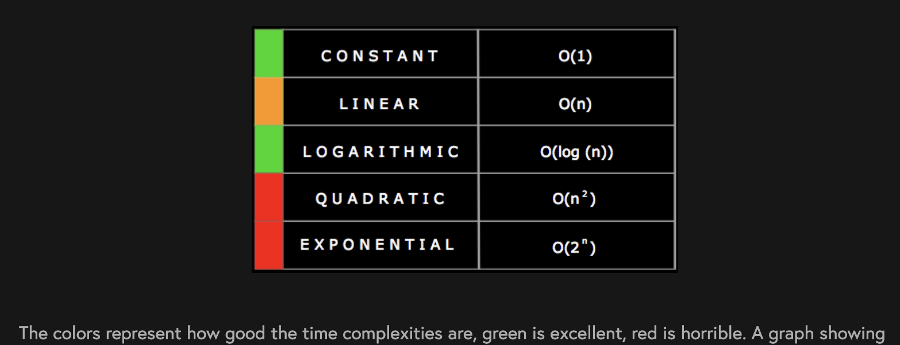
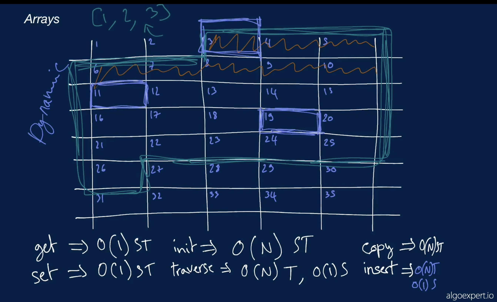
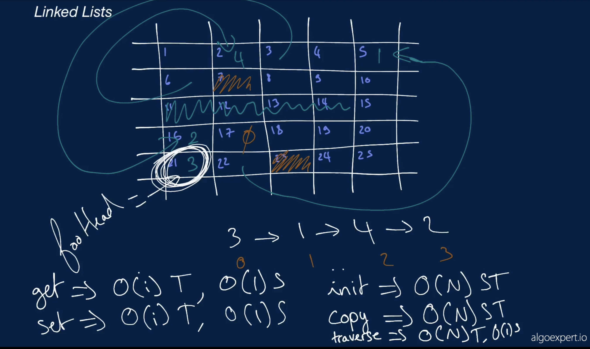

## Data Structures Crash Course (Algoexpert)

Complexity Analysis: 
The process of determining how efficient an algorithm is. Complexity analysis usually involves finding both the
    <b>time complexity</b> and the <b>space complexity</b> of an algorithm.

  

----

<h2>Big O notation 
</h2> - a powerful tool that allows us to generalize the space-time complexity of an algorithm as a function of its input size.

  The notation used to describe the <b>time complexity</b> and
  <b>space complexity</b> of algorithms.

  Variables used in Big O notation denote the sizes of inputs to algorithms. For
  example, <b>O(n)</b> might be the time complexity of an algorithm that
  traverses through an array of length <b>n</b>; similarly,
  <b>O(n + m)</b> might be the time complexity of an algorithm that traverses
  through an array of length <b>n</b> and through a string of length <b>m</b>.

  The following are examples of common complexities and their Big O notations,
  ordered from fastest to slowest:

<ul>
  <li><b>Constant</b>: O(1)</li>
  <li><b>Logarithmic</b>: O(log(n))</li>
  <li><b>Linear</b>: O(n)</li>
  <li><b>Log-linear</b>: O(nlog(n))</li>
  <li><b>Quadratic</b>: O(n2)</li>
  <li><b>Cubic</b>: O(n3)</li>
  <li><b>Exponential</b>: O(2n)</li>
  <li><b>Factorial</b>: O(n!)</li>
</ul>

  Note that in the context of coding interviews, Big O notation is usually
  understood to describe the
  <b>worst-case</b> complexity of an algorithm, even though the worst-case
  complexity might differ from the <b>average-case</b> complexity.

  For example, some sorting algorithms have different time complexities
  depending on the layout of elements in their input array. In rare cases, their
  time complexity will be much worse than in more common cases. Similarly, an
  algorithm that takes in a string and performs special operations on uppercase
  characters might have a different time complexity when run on an input string
  of only uppercase characters vs. on an input string with just a few uppercase
  characters.

  Thus, when describing the time complexity of an algorithm, it can sometimes be
  helpful to specify whether the time complexity refers to the average case or
  to the worst case (e.g., "this algorithm runs in O(nlog(n)) time on average
  and in O(n2) time in the worse case").

Brief overwiew: https://www.youtube.com/watch?v=__vX2sjlpXU 

----

<h2>Logarithm</h2> 

<b>logb(x) = y</b> if and only if <b>by = x</b>

Thus => 
<b>log(n) = y</b> if and only if <b>2y = n</b>

Key point:

<u>To find the (binary) logarithm of base of a number We have to say <b>2</b> to the **power** of **?** is that number. </u>  if we solve that, **?** is the **log of N**

Thus, To double **N**, we only need to increase **y** by 1. E.g:  22 = 4; 22+1 = 23 which **6**

If n doubles, log(n) only increases by 1

In plain English, if an algorithm has a logarithmic time complexity (<b>O(log(n))</b>, where n is the size of the input), then whenever the algorithm's input doubles in size (i.e., whenever <b>n</b> doubles), the number of
operations needed to
complete the algorithm only increases by one unit. Conversely, an algorithm with a linear time complexity would
see its number of operations double if its input size doubled.

----

<h2>Arrays</h2> 

2 types of Array:
Static & Dynamic

Static array operations and respective time and space complexities:

<h4>Array</h4>

  A linear collection of data values that are accessible at numbered indices,
  starting at index 0.

  The following are an array's standard operations and their corresponding time
  complexities:

<ul>
  <li><b>Accessing a value at a given index</b>: O(1)</li>
  <li><b>Updating a value at a given index</b>: O(1)</li>
  <li><b>Inserting a value at the beginning</b>: O(n)</li>
  <li><b>Inserting a value in the middle</b>: O(n)</li>
  <li>
    <b>Inserting a value at the end</b>:
    <ul>
      <li>amortized O(1) when dealing with a <b>dynamic array</b></li>
      <li>O(n) when dealing with a <b>static array</b></li>
    </ul>
  </li>
  <li><b>Removing a value at the beginning</b>: O(n)</li>
  <li><b>Removing a value in the middle</b>: O(n)</li>
  <li><b>Removing a value at the end</b>: O(1)</li>
  <li><b>Copying the array</b>: O(n)</li>
</ul>

  A static array is an implementation of an array that allocates a fixed amount
  of memory to be used for storing the array's values. Appending values to the
  array therefore involves copying the entire array and allocating new memory
  for it, accounting for the extra space needed for the newly appended value.
  This is a linear-time operation.

  A dynamic array is an implementation of an array that preemptively allocates
  double the amount of memory needed to store the array's values. Appending
  values to the array is a constant-time operation until the allocated memory is
  filled up, at which point the array is copied and double the memory is once
  again allocated for it. This implementation leads to an amortized
  constant-time insertion-at-end operation.

  A lot of popular programming languages like JavaScript and Python implement
  arrays as dynamic arrays.

----

<h2>Linked Lists</h2> 
A big difference between Linked Lists and arrays is that while arrays need back to back spaces in the memory to create an array. Linked Lists use any spaces available in the memory and then connect to one another (i.e other nodes) using pointers.

[Single Linked List](https://www.theavocoder.com/data-structures/2018/12/23/singly-linked-list)

Each node needs 2 back to back memory slots. one showing the value and the other showing the pointer. That's for the singly linked list

The double linkedlist has got two pointers. one pointing to the next node and the other pointing to the previous(prev) node. 

[Doubly linked list](https://www.theavocoder.com/data-structures/2018/12/23/doubly-linked-list)

<li><h4 >Singly Linked List</h4>

  A data structure that consists of nodes, each with some value and a pointer to
  the next node in the linked list. A linked list node's value and next node are
  typically stored in value
  and
  next properties, respectively.

  The first node in a linked list is referred to as the <b>head</b> of the
  linked list, while the last node in a linked list, whose
  next property points to the null value, is known as
  the <b>tail</b> of the linked list.

  Below is a visual representation of a singly linked list whose nodes hold
  integer values:

<pre>0 -&gt; 1 -&gt; 2 -&gt; 3 -&gt; 4 -&gt; 5 -&gt; null
</pre>

  A singly linked list typically exposes its head to its user for easy access.
  While finding a node in a singly linked list involves traversing through all
  of the nodes leading up to the node in question (as opposed to instant access
  with an array), adding or removing nodes simply involves overwriting
  next pointers (assuming that you have access to the node right
  before the node that you're adding or removing).

  The following are a singly linked list's standard operations and their
  corresponding time complexities:

<ul>
  <li><b>Accessing the head</b>: O(1)</li>
  <li><b>Accessing the tail</b>: O(n)</li>
  <li><b>Accessing a middle node</b>: O(n)</li>
  <li><b>Inserting / Removing the head</b>: O(1)</li>
  <li><b>Inserting / Removing the tail</b>: O(n) to access + O(1)</li>
  <li><b>Inserting / Removing a middle node</b>: O(n) to access + O(1)</li>
  <li><b>Searching for a value</b>: O(n)</li>
</ul>
</li><li><h4>Doubly Linked List</h4>

  Similar to a <b>singly linked list</b>, except that each node in a doubly
  linked list also has a pointer to the previous node in the linked list. The
  previous node is typically stored in a prev property.

  Just as the next property of a doubly linked list's
  <b>tail</b> points to the null value, so too does the
  prev property of a doubly linked list's <b>head</b>.

  Below is a visual representation of a doubly linked list whose nodes hold
  integer values:

<pre>null &lt;- 0 &lt;-&gt; 1 &lt;-&gt; 2 &lt;-&gt; 3 &lt;-&gt; 4 &lt;-&gt; 5 -&gt; null
</pre>

  While a doubly linked list typically exposes both its head and tail to its
  user, as opposed to just its head in the case of a singly linked list, it
  otherwise behaves very similarly to a singly linked list.

  The following are a doubly linked list's standard operations and their
  corresponding time complexities:

<ul>
  <li><b>Accessing the head</b>: O(1)</li>
  <li><b>Accessing the tail</b>: O(1)</li>
  <li><b>Accessing a middle node</b>: O(n)</li>
  <li><b>Inserting / Removing the head</b>: O(1)</li>
  <li><b>Inserting / Removing the tail</b>: O(1)</li>
  <li><b>Inserting / Removing a middle node</b>: O(n) to access + O(1)</li>
  <li><b>Searching for a value</b>: O(n)</li>
</ul>
</li><li><h4 >Circular Linked List</h4>

  A linked list that has no clear <b>head</b> or <b>tail</b>, because its "tail"
  points to its "head," effectively forming a closed circle.

  A circular linked list can be either a <b>singly circular linked list</b> or a
  <b>doubly circular linked list</b>.

</li>

----

<h2>Hash Tables</h2>

key:value data structure. The fact that they have these pairs makes <u>insertion, delete and search</u> all have **time complexities of constant time operations - O(i)**

Unlike arrays where the identifiers are indices and are not strings. In hash tables, the keys can be strings. Thus, one needs a hash function to convert them to integers as indices. 

[Hash tables](https://www.theavocoder.com/data-structures/2018/12/23/hash-table)

----

<h2>Stacks and Queues</h2> 

[Stacks](https://www.theavocoder.com/data-structures/2018/12/22/stacks) LIFO

[Queues](https://www.theavocoder.com/data-structures/2018/12/23/asoosfdsvt187fj6tri2t88dn01aab) FIFO